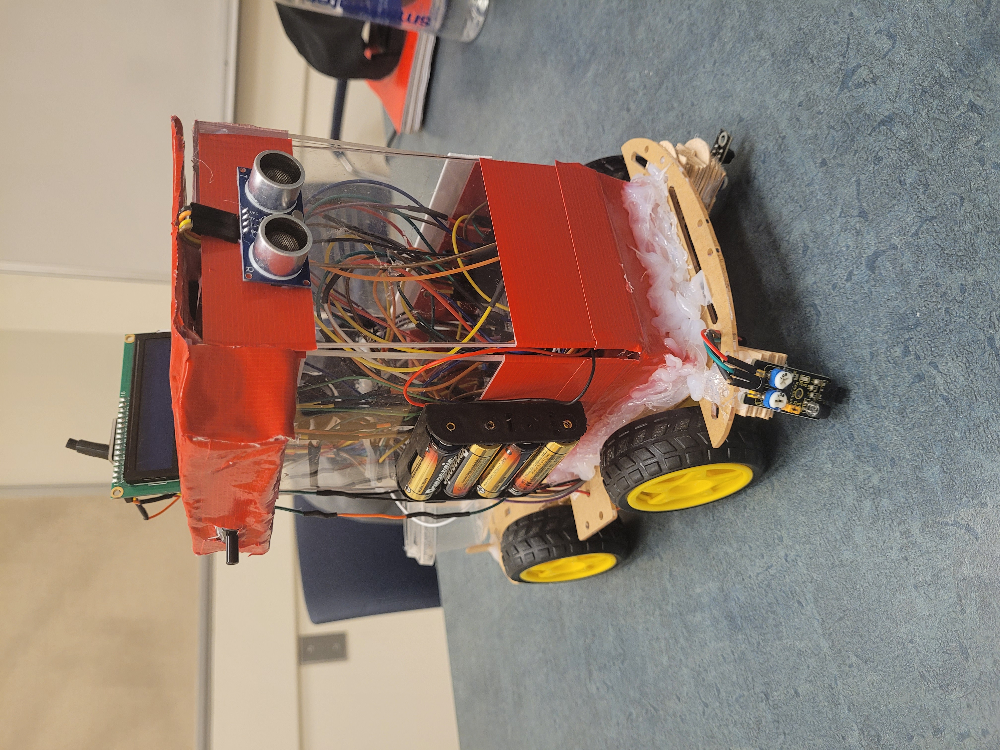
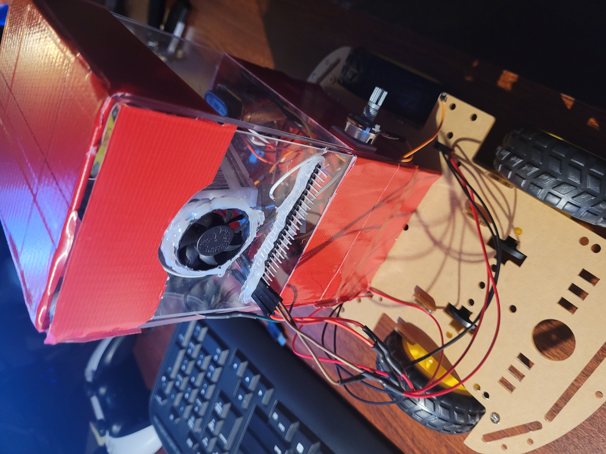

    

 
  

    

 

  
  
  

  
  
  

 
 

    

<h3 align = "center">👩‍💻 Languages</h3>

  
  

<h2></h2>

<h3 align="center">🚀 Development Tools & Environments</h3>

  
  

<h2></h2>

<h3 align="center">⚙️ Hardware and Microcontroller Boards</h3>

  

 

 

    

 

- <a href = "https://github.com/BinaryQuBit/Snack-Distributing-Robot/blob/main/Documents/Schematic.pdf">Schematic</a>

- <a href = "https://github.com/BinaryQuBit/Snack-Distributing-Robot/blob/main/Documents/Project%20Report.pdf">User Manual</a>